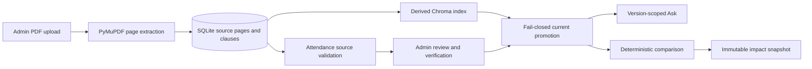

# RuleShift 2.0

RuleShift compares source-verified versions of academic attendance policies, calculates deterministic student impact, and answers attendance questions with PDF evidence. SQLite is authoritative. Original PDF bytes, extracted pages, clauses, verified rules, audit events, index generations, and impact snapshots live in SQLite. Chroma is a derived retrieval index that can be deleted and rebuilt.

RuleShift deliberately supports one executable policy domain in this release: ordinary minimum attendance percentages. The PDFs may contain other topics, and Ask can retrieve their text, but scholarship, examination, fee, hostel, library, exception, and deadline rules are not compiled into deterministic impact logic.



## Tech stack

- Backend: Python, FastAPI, Pydantic, SQLAlchemy, Alembic, PyMuPDF
- Retrieval: LangChain, Gemini API, persistent Chroma
- Frontend: React, Vite, React Router, plain CSS
- Tests: pytest, FastAPI TestClient, temporary real Chroma where integration coverage matters, Vitest and Testing Library

## Project structure

- `backend/main.py`: API routes and lifecycle orchestration
- `core/`: authentication, configuration, source interpretation, deterministic evaluation
- `database/`: SQLAlchemy authoritative and immutable-history models
- `services/`: PDF parsing, source persistence, source verification, index lifecycle
- `ai/`: LiteLLM generation, Gemini embeddings, version-filtered RAG
- `alembic/`: database migrations
- `frontend/src/`: student and admin pages
- `tests/`: backend unit, integration, security, migration, and large-PDF tests
- `evaluation/`: labelled attendance evaluation set
- `samples/policies/`: manual 50, 75, and 100-page PDF fixtures and fact sheets
- `scripts/`: evaluation, sample generation, and vector rebuild commands

## Prerequisites

- Python 3.9 or newer
- Node.js 20 or newer and npm
- A Gemini API key for generation and embeddings

## Fresh-clone setup

```sh
git clone <repository-url>
cd RuleShift2.0
python3 -m venv venv
source venv/bin/activate
pip install -r requirements.txt
cp .env.example .env
python -c "import secrets; print(secrets.token_hex(32))"
```

Edit `.env`: choose a local admin password and replace the JWT placeholder with the generated secret. Never commit `.env`.

Configure the Gemini API key in `.env` and migrate the database:

```sh
./venv/bin/alembic upgrade head
cd frontend
npm ci
cp .env.example .env
cd ..
```

## Configuration

| Variable | Purpose | Local default/example |
|---|---|---|
| `DATABASE_URL` | Authoritative SQL database | `sqlite:///./ruleshift.db` |
| `RULESHIFT_ADMIN_EMAIL` | Admin login email | local value in `.env` |
| `RULESHIFT_ADMIN_PASSWORD` | Admin login password | choose locally |
| `RULESHIFT_JWT_SECRET` | JWT HMAC secret, at least 32 random bytes | no safe default |
| `RULESHIFT_JWT_EXPIRE_MINUTES` | Session duration | `60` |
| `RULESHIFT_MAX_UPLOAD_BYTES` | Upload limit | `10485760` |
| `RULESHIFT_CHROMA_PATH` | Derived Chroma directory | `./chroma_db` |
| `RULESHIFT_GEMINI_API_KEY` | Backend-only Gemini API key | no safe default |
| `RULESHIFT_LITELLM_MODEL` | LiteLLM answer/extraction model | `gemini/gemini-3.5-flash-lite` |
| `RULESHIFT_EMBEDDING_PROVIDER` | Embedding provider | `google` |
| `RULESHIFT_EMBEDDING_MODEL` | Embedding model | `gemini-embedding-001` |
| `VITE_API_URL` | Browser API URL | `http://127.0.0.1:8000` |

## Run locally

Terminal one:

```sh
source venv/bin/activate
./venv/bin/alembic upgrade head
./venv/bin/uvicorn backend.main:app --reload --host 127.0.0.1 --port 8000
```

Terminal two:

```sh
cd frontend
npm run dev -- --host 127.0.0.1 --port 5173
```

Open `http://127.0.0.1:5173`. The header should show **API connected**. Admin login is at `/admin/login`; credentials come only from the local `.env`.

## Main workflows

### Administrator

1. Sign in and upload a text-based PDF.
2. Inspect the extracted attendance value and the reported authoritative source page.
3. Correct a mismatch only to the value supported by the source.
4. Verify the source-linked rule.
5. Mark the verified version current. Promotion checks source lineage, unresolved blocking validation issues, and the recorded/observed Chroma count.
6. Inspect Audit History for upload, blocked verification, source correction, verification, and publication events.

### Student

- Ask defaults to the current version when a policy has one; an explicitly selected reviewed historical version remains available for historical inspection.
- Compare accepts only a chronologically newer reviewed version from the same family.
- Student Impact evaluates the same attendance against old and new thresholds. The result includes expandable old/new clause evidence and is stored as an immutable snapshot.

## Tests and evaluation

Run every backend test, frontend test, labelled evaluation, and production build:

```sh
make verify
```

Individual commands:

```sh
make backend-test
make frontend-test
make evaluate
make build
```

The evaluation reads `evaluation/attendance_cases.json` and writes `reports/attendance_evaluation.json`. Its metrics describe only that small labelled dataset; they are not a claim about arbitrary university policies.

## Large-document test

The automated large-PDF suite exercises 50, 75, and 100-page PDFs through the authenticated upload route with real parsing, relational persistence, clause creation, and temporary Chroma indexing:

```sh
PYTHONPATH=. ./venv/bin/python -m pytest -q tests/test_large_pdf_ingestion.py tests/test_manual_policy_samples.py
```

For the manual demo, use the same policy name with chronological version labels and upload the PDFs under `samples/policies/`. Consult `samples/policies/manual_test_facts.json` for known values and exact pages.

## Vector rebuild and local reset

Rebuild all derived chunks from immutable SQLite clauses:

```sh
PYTHONPATH=. ./venv/bin/python scripts/rebuild_index.py
```

Back up `ruleshift.db` before a local reset. Stop the backend, then remove the ignored development database files and Chroma directory. Run `./venv/bin/alembic upgrade head` before restarting. This resets local policy and audit history; it does not change source code, migrations, or `.env`.

## 90-second demonstration

1. Open `/admin/login`, sign in, and upload an older sample PDF.
2. Show its stored source hash, page-aware source check, and DRAFT state.
3. Verify and mark it current.
4. Upload the newer same-family sample, verify it, then mark it current; show the old version as SUPERSEDED.
5. On Ask, choose the policy and ask “I have exactly 85% attendance. Am I compliant?” Show the concise response, page citation, and evidence drawer.
6. Compare the two versions and run Student Impact at a boundary value such as 80%.
7. Expand the old/new evidence in the impact result and return to Admin Audit History.

No database editing is part of the workflow.

## Known limitations

- Deterministic extraction, comparison, and impact cover only one ordinary minimum-attendance rule per version.
- Scanned/image-only PDFs are rejected; OCR and table-specific extraction are outside this release.
- Upload processing is synchronous. A failed vector write or SQL commit is compensated, but there is no background job queue.
- SQLite and local Chroma target a single-instance demonstration deployment.
- Explicit historical Ask is supported for reviewed versions; omitted-version Ask resolves only the current version.
- The small labelled evaluation is a release regression set, not a real-world accuracy benchmark.
- Docker packaging and cloud storage are future operational extensions.
